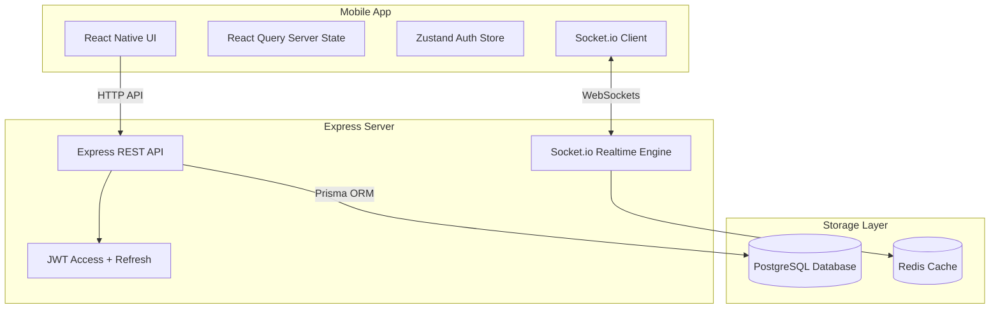

# CampusConnect 🚀

CampusConnect is a real-time collaboration app built for college students to find project partners, recruit hackathon teams, pitch ideas, chat in real time, and pick up short internal campus gigs.

Built as a full-stack portfolio monorepo with React Native, Node.js + Express, PostgreSQL, Prisma, and Socket.io.

---

## What it does

- **Project & Idea Board**: Post project pitches, filter by tech stack (React, Python, AI/ML, Rust, etc.) or branch, upvote ideas, and discuss in comments.
- **Team Formation**: Apply to projects with a short note -> project owner reviews applicants -> accepting an applicant automatically creates a private team group chat!
- **Real-Time Chat**: 1:1 and group chats with Socket.io (persisted history, online presence, typing indicators, auto-scroll).
- **Internal Gigs Board**: Post mini paid/bounty tasks or design gigs, submit pitches with portfolio links, and get hired by campus peers.
- **Real-Time Notifications**: Live notification feed for new applications, acceptance status changes, and incoming messages.

---

## Architecture Diagram



---

## Monorepo Layout

```
CampusConnect/
├── backend/          # Node.js + TypeScript + Express + Prisma ORM + Socket.io
│   ├── prisma/       # Database schema & demo seed script
│   ├── src/          # Controllers, routes, middleware, socket handlers
│   └── tests/        # Jest + Supertest integration test suite
├── mobile/           # React Native + TypeScript + React Navigation + Zustand
│   ├── src/          # Screens, UI components, API client, Zustand stores
│   └── App.tsx
├── docs/             # Architecture diagrams and API specifications
└── docker-compose.yml # Postgres + Redis local dev setup
```

---

## Quick Start (Run locally from clean clone)

### Prerequisites
- Node.js (v18+)
- Docker & Docker Compose (or local PostgreSQL)

### 1. Spin up Database Services
```bash
docker-compose up -d
```

### 2. Backend Setup & Seed Data
```bash
cd backend
npm install
npx prisma migrate dev --name init
npm run prisma:seed
npm run dev
```
> Server runs on `http://localhost:5000`

### 3. Mobile App Setup
```bash
cd ../mobile
npm install
npm start
```
> Press `w` to launch in Web browser, or scan QR code with Expo Go app on iOS/Android.

---

## Demo Accounts (Populated by Seed Script)

All accounts share the password: `password123`

- **Alex Chen** (`alex.chen@campus.edu`) - CS Senior / StudyBuddy AI Owner
- **Maya Patel** (`maya.patel@campus.edu`) - AI Major / EcoCampus Owner
- **Sophia Kim** (`sophia.kim@campus.edu`) - Cybersecurity / ZK Pass
- **Liam Ross** (`liam.ross@campus.edu`) - UI/UX Designer

---

## Running Integration Tests

```bash
cd backend
npx jest --forceExit
```
Tests cover JWT auth flow, duplicate registration prevention, project CRUD, upvoting, comments, and automated team formation.
