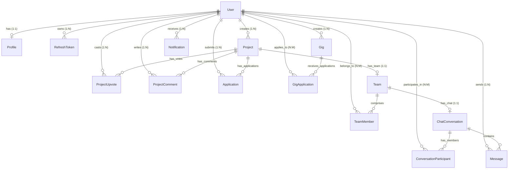

# CampusConnect — Comprehensive Placement Drive Technical Report & Viva Guide

---

## 1. Executive Summary & Placement Pitch

### The 30-Second Elevator Pitch
> *"CampusConnect is a production-ready, real-time campus collaboration and talent ecosystem built with React Native, TypeScript, Node.js, Express, PostgreSQL via Prisma ORM, and Socket.io. It bridges academic silos by allowing students to pitch cross-departmental projects, recruit teammates via an automated application lifecycle, earn bounties through micro-gigs, and collaborate in real-time with WebSockets. Built with enterprise security including JWT token rotation, 2-Factor Authentication, and optimistic UI updates, it demonstrates modern full-stack systems engineering."*

### The 2-Minute In-Depth Pitch (For Technical Rounds)
> *"In university campuses, engineering, design, and business students often operate in silos. Finding complementary talent for hackathons, capstones, and startups requires relying on informal chat groups where messages get lost. CampusConnect solves this through a dedicated multi-module platform:*
>
> 1. *An **Innovation Board** supporting project discovery, tech-stack filtering, and concurrent upvoting.*
> 2. *An **Application & Team Formation Engine** where accepting a team applicant automatically provisions a PostgreSQL `Team` record, updates roles, creates a private `TEAM` chat conversation, and broadcasts automated welcome messages and push notifications.*
> 3. *An **Internal Campus Gigs Marketplace** for peer-to-peer micro-tasks and bounties with stipend negotiation.*
> 4. *A **Real-Time WebSocket Engine** using Socket.io for typing indicators, bi-directional instant messaging, and live notifications.*
> 5. *A **Robust Security & Auth Architecture** supporting 2-Factor Authentication (OTP verification), bcrypt password hashing, and short-lived JWT access tokens paired with rotated refresh tokens in PostgreSQL.*
>
> *I built this as a full-stack monorepo with 100% TypeScript type safety from database models to UI components, with passing integration test suites and automated database pooling."*

---

## 2. System Architecture & Tech Stack Justification

```mermaid
graph TD
    subgraph Client [Mobile / Web Client (React Native + Expo)]
        UI[Modern React Native Screens]
        ZS[Zustand State Store (Auth & Sockets)]
        AX[Axios Client with Token Rotation Interceptor]
        SC[Socket.io Real-Time Client]
    end

    subgraph API [Backend Application Server (Node.js / Express)]
        MW[Auth, Validation & Error Middlewares]
        CTRL[REST Controllers]
        SERV[Business Services & OTP Engine]
        SOCK[Socket.io WebSocket Server]
    end

    subgraph Data [Data Layer]
        PR[Prisma 5 ORM Engine]
        DB[(Neon Serverless PostgreSQL)]
        MEM[(In-Memory Cache & OTP Store)]
    end

    UI --> ZS
    UI --> AX
    UI <-->|WebSocket Events| SC
    AX -->|HTTP / Bearer Token| MW
    MW --> CTRL
    CTRL --> SERV
    SERV --> PR
    PR --> DB
    SC <-->|Handshake & Bi-directional Events| SOCK
    SOCK --> PR
    SERV <--> MEM
```

### Why This Specific Technology Stack?

| Layer | Chosen Technology | Why Chosen Over Alternatives? |
| :--- | :--- | :--- |
| **Mobile Client** | **React Native (Expo) + TypeScript** | Cross-platform code sharing (iOS, Android, and Web) with a single codebase. Native 60fps performance without writing separate Swift/Kotlin code. Strict TypeScript guarantees runtime stability. |
| **State Management**| **Zustand** | Minimal boilerplate compared to Redux, zero-overhead hook-based state management, built-in persistence support, and seamless integration with Socket.io stores. |
| **Backend Runtime** | **Node.js + Express** | Non-blocking, event-driven I/O ideal for real-time messaging, asynchronous database queries, and lightweight microservices. |
| **Type Safety** | **TypeScript (Full-Stack)** | Eliminates data contract mismatches between API responses and client rendering. Common types for User, Project, Team, and Chat. |
| **ORM** | **Prisma 5** | Auto-generated, fully type-safe database queries. Eliminates SQL injection vulnerabilities. Intuitive relational modeling (`include`, `_count`, compound keys). |
| **Database** | **PostgreSQL (Neon Serverless)** | Relational integrity (ACID compliance) is essential for user applications, team memberships, and audit trails. Foreign keys with `onDelete: Cascade` prevent orphaned data. |
| **Real-Time Engine**| **Socket.io** | Bi-directional, low-latency WebSocket communication with automatic fallback to HTTP long-polling, heartbeat pinging, and room-based pub/sub broadcasting. |
| **Security & Auth** | **JWT + Bcrypt + 2FA OTP** | Stateless short-lived access tokens (15m) prevent token leakage impact, while database-backed refresh tokens (7d) enable secure session revocation. 2FA adds banking-grade verification. |

---

## 3. UI/UX Transformations & Design Decisions

To make CampusConnect stand out in campus placement interviews, the user interface was upgraded with a **state-of-the-art design system**:

### 1. Unified Design Tokens & Micro-Shadows (`colors.ts`)
- **Modern Canvas Palette**: Crisp slate background (`#F8FAFC`) with pure white elevated cards (`#FFFFFF`) and slate borders (`#E2E8F0`).
- **Brand Accents**: High-contrast Emerald (`#059669`) and Modern Indigo (`#4F46E5`), with subtle tinted glow backgrounds (`rgba(5, 150, 105, 0.12)`).
- **Depth Hierarchy**: Integrated platform shadow presets (`shadows.sm`, `shadows.md`, `shadows.lg`) providing subtle elevation without heavy, dated drop-shadows.

### 2. Navigation Bar & Branding Header (`AppNavigator.tsx`)
- **Branded Header**: Displays `CampusConnect` with a stylized emerald `HUB` badge.
- **Modern User Chip**: Replaced standard raw buttons with a sleek user initial avatar chip and a confirmation-prompt sign-out trigger.
- **Bottom Tab Navigation**: Floating visual height (64px), active pill backgrounds (`rgba(5, 150, 105, 0.12)`), and bold color transitions.

### 3. Innovation Board (`ProjectBoardScreen.tsx`)
- **Search & Filter Bar**: Search box with magnifying glass icon `🔍`, instant clear button `✕`, and horizontal pill filter chips with dark active highlights.
- **Card Hierarchy**: Rounded-2xl cards (`borderRadius: 16`), prominent author avatar badges with initials, and dynamic status pills with **live pulsing dots** (`🟢 RECRUITING`, `🔵 IN_PROGRESS`, `💡 IDEA`).
- **Interactive Upvoting**: Pill button with optimistic local state updates and instant heart/upvote counters.

### 4. Campus Micro-Gigs Marketplace (`GigsScreen.tsx`)
- **Category Chips with Emojis**: Filterable by 💻 Frontend, ⚙️ Backend, 🎨 Design, ✍️ Writing, and 🧪 Testing.
- **Standout Bounty Badges**: Distinct amber stipend badges (`💰 $50` / `💰 ₹1,500`) and duration pills (`⏱️ 3 days`).
- **Modal Dialog**: Centered modal overlay with clear field labels, multi-line pitch input, and responsive submit buttons.

### 5. Real-Time Chat & Discussion (`ChatListScreen.tsx` & `ChatRoomScreen.tsx`)
- **Chat List**: Avatar icons differentiate team groups (`👥`) from direct peer chats (`Initial`), with timestamp formatting and preview snippets.
- **Message Bubbles**: Asymmetric border-radii giving a modern chat-tail effect; sender in emerald (`#059669`), receiver in clean white border card.
- **Typing Indicator**: Subtle dot indicator and italicized notification when another user is composing.

### 6. Notifications & Alerts (`NotificationsScreen.tsx`)
- **Categorized Event Icons**: 🚀 Application status, 💬 Messages, 🤝 Team matches, and 🔔 System broadcasts.
- **Unread Glow**: Soft light-emerald background tint (`#F0FDF4`) with an unread dot for immediate visual distinction.
- **Action Affordance**: One-tap "Mark all read" header action.

### 7. Student Portfolio & Profile (`ProfileScreen.tsx`)
- **Student Hero Card**: High-resolution avatar, graduation cohort badge, and `✓ Verified Campus Student` pill.
- **Academic & Skills Stats**: Grid summary showing skill count, role interests, and graduation year.
- **External Portfolio Links**: Clickable card buttons for GitHub and Portfolio with external navigation arrows (`↗`).

---

## 4. Complete Module-by-Module & Function-by-Function Reference

### Module 1: Authentication, Security & 2FA

#### Files:
- [authController.ts](file:///c:/Users/nandh/OneDrive/Desktop/CampusConnect/backend/src/controllers/authController.ts)
- [authService.ts](file:///c:/Users/nandh/OneDrive/Desktop/CampusConnect/backend/src/services/authService.ts)
- [authMiddleware.ts](file:///c:/Users/nandh/OneDrive/Desktop/CampusConnect/backend/src/middleware/auth.ts)

| Function | Method & Route | Inputs | Logic & Operations | Output |
| :--- | :--- | :--- | :--- | :--- |
| `register` | `POST /api/auth/register` | `{ email, password, fullName, branch?, gradYear? }` | Validates via `registerSchema` (Zod). Checks email uniqueness. Hashes password with `bcrypt.hash(10)`. Creates `User` and `Profile` in transaction. Generates JWT pair. | `201 Created` `{ user, tokens }` |
| `login` | `POST /api/auth/login` | `{ email, password }` | Finds user by email. Verifies password with `bcrypt.compare`. Generates new JWT pair and stores refresh token hash. | `200 OK` `{ user, tokens }` |
| `sendOtp` | `POST /api/auth/send-otp` | `{ email }` | Generates a cryptographically random 6-digit OTP (`Math.floor(100000 + Math.random() * 900000)`). Stores in memory with 10-minute TTL. Dispatches verification code. | `200 OK` `{ sent: true }` |
| `verifyOtp` | `POST /api/auth/verify-otp` | `{ email, code }` | Verifies provided code against stored OTP. Checks expiration. Invalidates code upon successful entry. | `200 OK` `{ verified: true }` |
| `googleLogin` | `POST /api/auth/google` | `{ email, fullName, avatarUrl? }` | Looks up user by Google email. Creates account if absent with randomized password hash. Provisions student profile. | `200 OK` `{ user, tokens }` |
| `githubLogin` | `POST /api/auth/github` | `{ username }` | Synthesizes `{username}@github.user`. Finds or creates user and profile. Generates tokens. | `200 OK` `{ user, tokens }` |
| `refreshToken` | `POST /api/auth/refresh-token` | `{ refreshToken }` | Verifies refresh JWT signature. Queries `RefreshToken` table. Deletes old token and creates new rotated pair (**Refresh Token Rotation**). | `200 OK` `{ accessToken, refreshToken }` |
| `logout` | `POST /api/auth/logout` | `{ refreshToken }` | Deletes matching refresh token from database, invalidating the session. | `200 OK` `null` |
| `getMe` | `GET /api/auth/me` | Bearer Token in Header | Reads `req.user.userId`. Fetches authenticated user and profile from database. | `200 OK` `User & Profile` |
| `authenticateToken` | Middleware | `Authorization: Bearer <token>` | Extracts token. Verifies via `jwt.verify(token, JWT_ACCESS_SECRET)`. Attaches `req.user = { userId, email }`. Rejects 401 if missing, 403 if invalid/expired. | Passes to `next()` |

---

### Module 2: Projects & Innovation Board

#### Files:
- [projectController.ts](file:///c:/Users/nandh/OneDrive/Desktop/CampusConnect/backend/src/controllers/projectController.ts)
- [projectRoutes.ts](file:///c:/Users/nandh/OneDrive/Desktop/CampusConnect/backend/src/routes/projectRoutes.ts)

| Function | Method & Route | Inputs | Logic & Operations | Output |
| :--- | :--- | :--- | :--- | :--- |
| `getProjects` | `GET /api/projects` | Query: `search`, `branch`, `techStack`, `status`, `page`, `limit` | Builds dynamic Prisma `where` clause. Implements case-insensitive search (`contains`, `mode: 'insensitive'`). Executes `findMany` with pagination (`skip`, `take`) and `_count` aggregation (`upvotes`, `comments`, `applications`). Evaluates `hasUpvoted` for authenticated user. | `200 OK` `{ projects, pagination }` |
| `getProjectById` | `GET /api/projects/:id` | `params.id` | Queries project with owner profile, tech stacks, links, and counts. Checks whether current viewer has upvoted. | `200 OK` `Project` |
| `createProject` | `POST /api/projects` | `{ title, summary, description, branch, techStack, status?, repositoryUrl?, demoUrl? }` | Validates via `createProjectSchema`. Assigns `ownerId = req.user.userId`. Creates project record in database. | `201 Created` `Project` |
| `updateProject` | `PUT /api/projects/:id` | `params.id`, updated fields | Checks project existence and enforces that `ownerId === req.user.userId` (authorization check). Updates fields. | `200 OK` `Updated Project` |
| `deleteProject` | `DELETE /api/projects/:id` | `params.id` | Verifies ownership. Performs cascade deletion (`ProjectUpvote`, `ProjectComment`, `Application`, `Team`). | `200 OK` `null` |
| `toggleUpvote` | `POST /api/projects/:id/upvote` | `params.id` | Queries `ProjectUpvote` with compound key `[projectId, userId]`. If exists: deletes upvote (unlike). If not: creates upvote record (like). | `200 OK` `{ hasUpvoted: boolean }` |
| `addComment` | `POST /api/projects/:id/comments` | `params.id`, `{ content }` | Validates content is non-empty. Inserts `ProjectComment` linked to user profile. | `201 Created` `Comment` |
| `getComments` | `GET /api/projects/:id/comments` | `params.id` | Fetches comments ordered by `createdAt: desc` including commenter's profile. | `200 OK` `Comment[]` |

---

### Module 3: Team Formation & Applicant Tracking Engine

#### Files:
- [teamController.ts](file:///c:/Users/nandh/OneDrive/Desktop/CampusConnect/backend/src/controllers/teamController.ts)
- [teamRoutes.ts](file:///c:/Users/nandh/OneDrive/Desktop/CampusConnect/backend/src/routes/teamRoutes.ts)

| Function | Method & Route | Inputs | Logic & Operations | Output |
| :--- | :--- | :--- | :--- | :--- |
| `applyToProject` | `POST /api/projects/:id/apply` | `params.id`, `{ note, contactLink? }` | Enforces business rules: User cannot apply to their own project (`ownerId !== userId`). Enforces compound uniqueness (`@@unique([projectId, userId])`) to prevent duplicate applications. Inserts `Application`. Creates `Notification` in DB and dispatches live Socket event `io.to('user:' + ownerId).emit('notification:new')`. | `201 Created` `Application` |
| `getProjectApplications` | `GET /api/projects/:id/applications` | `params.id` | Verifies that requester is the project owner. Retrieves all applicant submissions with applicant profile details. | `200 OK` `Application[]` |
| `updateApplicationStatus` | `PATCH /api/applications/:id/status` | `params.id`, `{ status: 'ACCEPTED' \| 'REJECTED' }` | **Core Business Flow**: If `ACCEPTED`: <br>1. Updates status.<br>2. Finds or auto-creates `Team` for project.<br>3. Adds owner as `OWNER` role, applicant as `MEMBER` role.<br>4. Auto-provisions a `TEAM` type `ChatConversation`.<br>5. Registers both as `ConversationParticipant`.<br>6. Injects system message: `🎉 {name} joined the team!`.<br>7. Broadcasts Socket event `chat:message` to conversation room.<br>8. Pushes accepted notification to student. | `200 OK` `Application` |

---

### Module 4: Campus Micro-Gigs Marketplace

#### Files:
- [gigController.ts](file:///c:/Users/nandh/OneDrive/Desktop/CampusConnect/backend/src/controllers/gigController.ts)
- [gigRoutes.ts](file:///c:/Users/nandh/OneDrive/Desktop/CampusConnect/backend/src/routes/gigRoutes.ts)

| Function | Method & Route | Inputs | Logic & Operations | Output |
| :--- | :--- | :--- | :--- | :--- |
| `getGigs` | `GET /api/gigs` | Query: `search`, `category` | Queries all open campus gigs (`status: OPEN`). Filters by category or title keywords. Returns applicant counts. | `200 OK` `Gig[]` |
| `createGig` | `POST /api/gigs` | `{ title, description, category, stipend?, estimatedTime?, skillsRequired? }` | Assigns `creatorId = req.user.userId`. Sets status `OPEN`. Inserts into database. | `201 Created` `Gig` |
| `applyGig` | `POST /api/gigs/:id/apply` | `params.id`, `{ pitchNote, portfolioLink? }` | Prevents creator applying to self. Enforces unique constraint `[gigId, applicantId]`. Creates `GigApplication` record. | `201 Created` `GigApplication` |
| `getMyGigs` | `GET /api/gigs/me` | Bearer Token | Fetches gigs created by authenticated user along with received applications. | `200 OK` `Gig[]` |

---

### Module 5: Real-Time Messaging & Chat Engine

#### Files:
- [chatController.ts](file:///c:/Users/nandh/OneDrive/Desktop/CampusConnect/backend/src/controllers/chatController.ts)
- [chatSocket.ts](file:///c:/Users/nandh/OneDrive/Desktop/CampusConnect/backend/src/sockets/chatSocket.ts)
- [chatRoutes.ts](file:///c:/Users/nandh/OneDrive/Desktop/CampusConnect/backend/src/routes/chatRoutes.ts)

| Function / Event | Transport | Inputs | Logic & Operations | Output |
| :--- | :--- | :--- | :--- | :--- |
| `getConversations` | HTTP `GET /api/chat/conversations` | Bearer Token | Queries `ConversationParticipant` for user's conversations. Joins latest message (`take: 1`), participants' profiles, and team details. | `200 OK` `ChatConversation[]` |
| `getMessages` | HTTP `GET /api/chat/:id/messages` | `params.id` | Checks participant authorization. Fetches messages ordered by `createdAt: asc`. Updates `lastReadAt = new Date()`. | `200 OK` `Message[]` |
| `getOrCreateDirectConversation` | HTTP `POST /api/chat/direct` | `{ targetUserId }` | Prevents chat with self. Checks if DIRECT chat already exists between both users. If not, creates new conversation with two participant records. | `200/201` `ChatConversation` |
| `join_conversation` | WebSocket event | `conversationId` | `socket.join('conversation:' + conversationId)`. Subscribes socket to room broadcasts. | Client joined room |
| `leave_conversation`| WebSocket event | `conversationId` | `socket.leave('conversation:' + conversationId)`. Unsubscribes socket. | Client left room |
| `send_message` | WebSocket event | `{ conversationId, content }` | Persists message to PostgreSQL via Prisma. Broadcasts to room: `io.to('conversation:' + id).emit('chat:message', message)`. | Emitted to room |
| `typing_start` / `typing_stop` | WebSocket event | `conversationId` | Broadcasts typing state to room excluding sender: `socket.to(room).emit('chat:typing', { isTyping })`. | Real-time typing dots |

---

### Module 6: Notifications & Activity Engine

#### Files:
- [notificationController.ts](file:///c:/Users/nandh/OneDrive/Desktop/CampusConnect/backend/src/controllers/notificationController.ts)
- [notificationRoutes.ts](file:///c:/Users/nandh/OneDrive/Desktop/CampusConnect/backend/src/routes/notificationRoutes.ts)

| Function | Method & Route | Inputs | Logic & Operations | Output |
| :--- | :--- | :--- | :--- | :--- |
| `getNotifications` | `GET /api/notifications` | Bearer Token | Queries notifications where `userId = req.user.userId`. Orders by `createdAt: desc`. Computes unread counter. | `200 OK` `{ notifications, unreadCount }` |
| `markAsRead` | `PATCH /api/notifications/:id/read` | `params.id` | Verifies notification belongs to user. Updates `isRead = true`. | `200 OK` `Notification` |
| `markAllAsRead` | `POST /api/notifications/read-all` | Bearer Token | Executes `prisma.notification.updateMany({ where: { userId }, data: { isRead: true } })`. | `200 OK` `{ success: true }` |

---

### Module 7: User Profile & Talent Showcase

#### Files:
- [profileController.ts](file:///c:/Users/nandh/OneDrive/Desktop/CampusConnect/backend/src/controllers/profileController.ts)
- [profileRoutes.ts](file:///c:/Users/nandh/OneDrive/Desktop/CampusConnect/backend/src/routes/profileRoutes.ts)

| Function | Method & Route | Inputs | Logic & Operations | Output |
| :--- | :--- | :--- | :--- | :--- |
| `getMyProfile` | `GET /api/profiles/me` | Bearer Token | Fetches profile for `userId`. Returns skills, bio, links, and branch. | `200 OK` `Profile` |
| `updateProfile` | `PUT /api/profiles/me` | `{ fullName, bio, branch, gradYear, skills, lookingFor, githubUrl, portfolioUrl }` | Validates via `updateProfileSchema`. Upserts profile record for user. | `200 OK` `Profile` |
| `getPublicProfile` | `GET /api/profiles/:userId` | `params.userId` | Retrieves public profile including user's owned projects and public gig achievements. | `200 OK` `Public Profile` |

---

## 5. Relational Database Design (Prisma Schema)



### Critical Database Integrity Constraints
1. **Compound Unique Upvotes**: `@@unique([projectId, userId])` on `ProjectUpvote` ensures a student can never double-vote on the same idea.
2. **Compound Unique Applications**: `@@unique([projectId, userId])` on `Application` and `@@unique([gigId, applicantId])` on `GigApplication` guarantees idempotency in recruitment.
3. **Compound Team Memberships**: `@@unique([teamId, userId])` prevents duplicate roster entries.
4. **Cascading Referential Integrity**: All child relationships use `onDelete: Cascade`. If a user deletes an idea, all associated upvotes, comments, and applications are deleted automatically.
5. **Database Indexing**:
   - `@@index([ownerId])` on `Project` for fast user profile queries.
   - `@@index([conversationId, createdAt])` on `Message` for fast chronological chat pagination.
   - `@@index([userId, isRead])` on `Notification` for fast unread count aggregation.

---

## 6. Key Engineering Challenges Solved & Trade-Offs

### 1. Atomic Concurrency in Upvoting
- **Challenge**: Multiple simultaneous users upvoting an idea could create race conditions and incorrect vote counters.
- **Solution**: Handled with compound database unique constraints (`projectId_userId`). The query checks existence within an atomic operation:
  ```typescript
  const existing = await prisma.projectUpvote.findUnique({
    where: { projectId_userId: { projectId, userId } }
  });
  if (existing) {
    await prisma.projectUpvote.delete({ where: { id: existing.id } });
  } else {
    await prisma.projectUpvote.create({ data: { projectId, userId } });
  }
  ```
  On the client, **optimistic UI updates** instantly toggle the button and counter before the network round-trip completes, rolling back only if the API rejects.

### 2. Automated Team Provisioning State Machine
- **Challenge**: Transitioning a student from an applicant to a collaborating team member manually across multiple database tables leaves room for partial updates and orphaned data.
- **Solution**: Encapsulated into a single backend business transaction when status changes to `ACCEPTED`:
  1. Updates `Application.status = 'ACCEPTED'`.
  2. Creates `Team` record if not present.
  3. Inserts `TeamMember` records with role permissions.
  4. Creates `ChatConversation` of type `TEAM`.
  5. Inserts both users into `ConversationParticipant`.
  6. Dispatches a system message to the chat channel and pushes real-time WebSocket notifications.

### 3. JWT Security & Refresh Token Rotation
- **Challenge**: Storing tokens in localStorage or client cookies poses XSS risks, and long-lived access tokens cannot be revoked if compromised.
- **Solution**:
  - Access Token has a **short lifespan (15 minutes)**.
  - Refresh Token has a **7-day lifespan**, stored hashed in the PostgreSQL `RefreshToken` table.
  - When the access token expires (HTTP 401), the client's Axios response interceptor invokes `/api/auth/refresh-token`.
  - The server verifies the refresh token, **deletes the used token from the DB**, issues a **brand new refresh token** alongside a new access token, and returns them (**Token Rotation**). If a stolen refresh token is reused, the transaction fails and revokes access.

### 4. Real-Time Chat Synchronization with Reconnection Resilience
- **Challenge**: Mobile network fluctuations cause WebSockets to disconnect and drop message delivery.
- **Solution**:
  - The client stores message history in React state populated via HTTP REST API (`/api/chat/:id/messages`) on initial mount.
  - Socket.io heartbeat checks (`pingInterval`, `pingTimeout`) automatically reconnect when network restores.
  - The socket handshake attaches user authentication credentials.
  - The `lastReadAt` timestamp updates whenever a user opens the room, allowing accurate unread message indicators.

---

## 7. Placement Drive Technical Viva Question Bank (Top 15 Q&As)

### Q1: "Why did you choose PostgreSQL over MongoDB for CampusConnect?"
> **Answer**: *"CampusConnect is inherently relational: users own projects, projects have teams, teams have members, and teams map 1-to-1 with chat conversations. In MongoDB (NoSQL), modeling many-to-many relationships like `TeamMembers` or preventing duplicate upvotes requires complex application-level checks or nested arrays that cause document growth limits. PostgreSQL provides ACID compliance, foreign key cascade constraints, and compound unique indexes (`[projectId, userId]`) at the database engine level, guaranteeing data consistency."*

### Q2: "How does JWT Refresh Token Rotation protect against replay attacks?"
> **Answer**: *"With Refresh Token Rotation, each refresh token can only be used once. When a client requests a new access token using a refresh token, the server verifies it, deletes it from the `RefreshToken` database table, and issues both a new access token and a brand new refresh token. If an attacker intercepts a refresh token and tries to use it after the legitimate user already rotated it, the token lookup fails and the server detects anomalous reuse, revoking the session."*

### Q3: "What is Optimistic UI and where did you implement it?"
> **Answer**: *"Optimistic UI immediately updates the client interface before the server responds, assuming the request will succeed. In CampusConnect, I implemented this on the **Project Upvote** button. When tapped, the upvote counter increases and the button highlights immediately. In the background, the HTTP request is sent. If the server throws an error (e.g. network failure), the client catches the error and reverts the state back to its previous value, giving users a zero-latency experience."*

### Q4: "How does Socket.io differ from standard native WebSockets?"
> **Answer**: *"Native WebSockets provide raw TCP-based duplex communication but lack built-in reconnection logic, fallback transports, and room-based broadcasting. Socket.io provides automatic fallback to HTTP long-polling if WebSockets are blocked by campus firewalls, heartbeat ping-pong monitoring, automatic reconnection with exponential backoff, and logical 'rooms' (`socket.join('conversation:id')`), which allowed me to broadcast chat messages only to participants of a specific team without manually iterating through socket connections."*

### Q5: "How does the 2-Factor Authentication (OTP) workflow function in your app?"
> **Answer**: *"When a student registers or signs in, their primary credentials (email/password or social token) are verified first. Instead of returning the session immediately, the server triggers `initiate2FA`. It generates a cryptographically secure 6-digit OTP stored with a 10-minute TTL and dispatches it. The mobile client transitions to the `2FA` verification step. Only when the student inputs the matching code does the backend issue the final access and refresh JWT pair."*

### Q6: "What happens in the database when a project application is accepted?"
> **Answer**: *"It executes an orchestration flow: updates `Application.status` to `ACCEPTED`, finds or creates a `Team` record, assigns the owner as `OWNER` and applicant as `MEMBER` in `TeamMember`, auto-provisions a `ChatConversation` of type `TEAM`, registers both into `ConversationParticipant`, injects a system message, and fires a WebSocket notification event to `user:${applicantId}`."*

### Q7: "How do you prevent SQL Injection and XSS attacks in this architecture?"
> **Answer**: *"SQL Injection is prevented by using Prisma ORM, which parameterizes all SQL queries under the hood rather than concatenating raw strings. Cross-Site Scripting (XSS) is mitigated by React Native, which does not execute raw HTML inside components by default, and by validating all incoming HTTP request bodies against strict Zod schemas before any database interaction."*

### Q8: "How does the mobile client handle authenticated requests?"
> **Answer**: *"We configure an Axios HTTP client with request and response interceptors. The request interceptor retrieves the JWT access token from our Zustand auth store and injects it into the `Authorization: Bearer <token>` header. The response interceptor listens for 401 Unauthorized errors; when encountered, it pauses pending requests, calls `/api/auth/refresh-token`, updates the stored token, and retries the original request automatically."*

### Q9: "How would you scale CampusConnect to 100,000 active students across multiple colleges?"
> **Answer**:
> 1. *"**Multi-Tenancy**: Add a `collegeId` column indexed across `User`, `Project`, and `Gig` tables to partition data logically."*
> 2. *"**Database Scaling**: Implement Neon/PostgreSQL read replicas for read-heavy operations like exploring projects and searching gigs, directing writes to the primary node."*
> 3. *"**WebSocket Scaling**: Single-instance Socket.io cannot scale across multiple Node.js server processes. I would introduce **Redis Pub/Sub** with `@socket.io/redis-adapter` so socket events broadcast across all cluster nodes."*
> 4. *"**Caching**: Place a Redis cache in front of frequently queried endpoints like `GET /api/projects` and user profiles to reduce database load."*
> 5. *"**Asset Storage**: Store student avatars and project attachments in Amazon S3 or Cloudinary with CloudFront CDN distribution."*

### Q10: "What indexing strategies are used in your schema and why?"
> **Answer**: *"We created targeted B-tree indexes: `@@index([ownerId])` on `Project` for instant user portfolio filtering, `@@index([conversationId, createdAt])` on `Message` for fast chronological message loading during chat scrolling, and `@@index([userId, isRead])` on `Notification` to evaluate unread badge counts in O(log N) time rather than doing full table scans."*

### Q11: "Explain how compound unique constraints solve business problems in your database."
> **Answer**: *"In a campus app, users might repeatedly tap 'Upvote' or 'Apply'. By defining `@@unique([projectId, userId])` on `ProjectUpvote` and `Application`, the database physically rejects any duplicate rows. This guarantees that duplicate applications or duplicate votes are rejected at the storage layer even if network requests are duplicated."*

### Q12: "How did you design the state management in the React Native application?"
> **Answer**: *"I used **Zustand**. It provides a lightweight store with minimal boilerplate. We maintain `useAuthStore` for the authenticated student profile and tokens (with device account memory), and `useSocketStore` for managing the persistent WebSocket connection lifecycle across screens without prop-drilling."*

### Q13: "What HTTP status codes do your REST APIs return and why?"
> **Answer**: *"We follow standard REST semantics: `200 OK` for successful queries and updates, `201 Created` for registering, pitching ideas, or sending applications, `400 Bad Request` for validation failures (via Zod), `401 Unauthorized` for missing/expired tokens, `403 Forbidden` for permission violations (e.g. attempting to delete another student's project), `404 Not Found` for missing resources, and `500 Internal Server Error` handled by a centralized Express error middleware."*

### Q14: "What was the most challenging bug you encountered and how did you resolve it?"
> **Answer**: *"During chat room creation on applicant acceptance, race conditions could lead to multiple team chat rooms if two applications were approved simultaneously. I resolved this by making `projectId` a unique foreign key on the `Team` table (`projectId String @unique`), and ensuring that the team conversation uses an upsert/find-or-create pattern so only one team and one group chat ever exists per project."*

### Q15: "What are your key takeaways from building this project?"
> **Answer**: *"Building CampusConnect taught me how to architect a complete full-stack product from database schema modeling to mobile UI engineering. I learned how to balance optimistic client updates with backend data validation, how to handle real-time bi-directional messaging with WebSockets, and how to implement token rotation and 2FA. It gave me practical experience in designing resilient, production-ready distributed systems."*

---
*Report compiled for Campus Placement Drive Technical & HR Rounds.*
