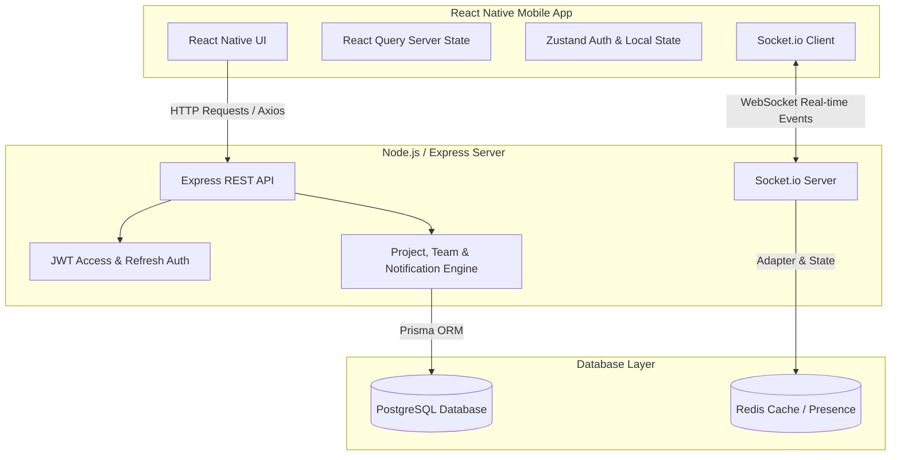

# CampusConnect - Architecture Overview

CampusConnect is structured as a pragmatic full-stack monorepo designed for real-time campus collaboration.

## Data Flow Highlights

1. **Authentication Flow**:
   - Short-lived Access Token (15 min) + Rotated Refresh Token (7 days stored in DB).
   - Axios request interceptor attaches Bearer token automatically; response interceptor triggers token rotation on 401.

2. **Team Formation & Automated Chat Provisioning**:
   - When a project owner accepts a pending applicant application (`PATCH /api/applications/:id/status`), the backend transaction:
     - Creates or attaches the `Team` record.
     - Adds owner (`OWNER`) and student (`MEMBER`) to `TeamMember`.
     - Creates a `TEAM` group chat in `ChatConversation`.
     - Injects an automated system message into the chat stream.
     - Pushes a real-time notification over Socket.io to the applicant.

3. **Real-time Messaging & Notifications**:
   - Socket connections authenticate via JWT handshake.
   - Users join private channels (`user:userId`) and active chat rooms (`conversation:conversationId`).
   - Typing indicators (`typing_start` / `typing_stop`) broadcast instantly across room participants.
